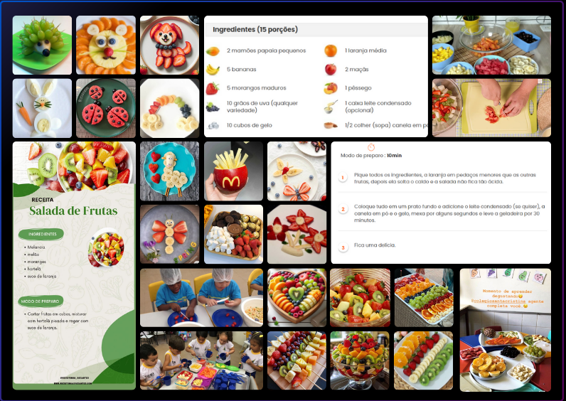
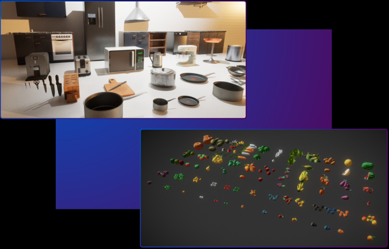
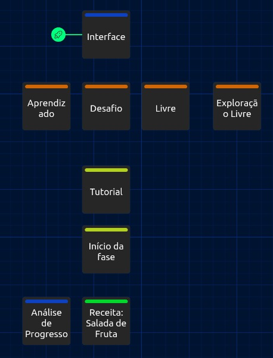
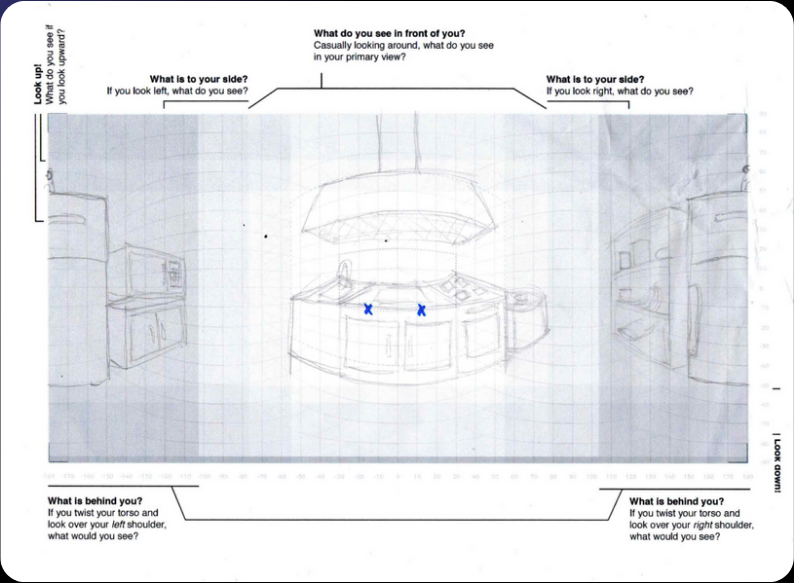
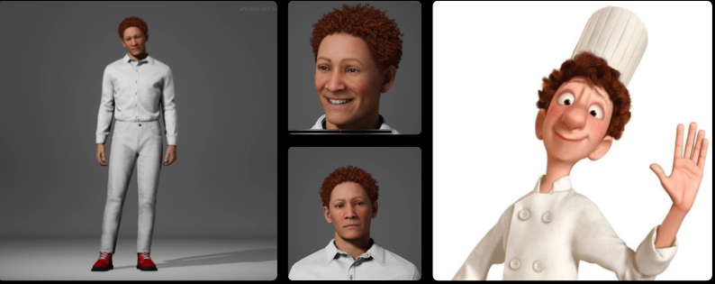

# Semana 2

## Apresentação

<iframe style={{
            display: 'block',
            margin: 'auto',
            width: '100%',
            height: '50vh',
        }} 
        loading="lazy"
        src="https://www.canva.com/design/DAGX26QMnn0/kJ8ORYd1AGi7hyk5QM5cDg/view?embed" allowfullscreen="allowfullscreen" allow="fullscreen"
        frameborder="0">
  </iframe>

<a href="https:&#x2F;&#x2F;www.canva.com&#x2F;design&#x2F;DAGX26QMnn0&#x2F;kJ8ORYd1AGi7hyk5QM5cDg&#x2F;view?utm_content=DAGX26QMnn0&amp;utm_campaign=designshare&amp;utm_medium=embeds&amp;utm_source=link" target="_blank" rel="noopener">Remi Solutions - Semana 2</a> de Filipi Kikuchi

# Painel de Referências - REMI SOLUTIONS

## Semana 2

---

## Introdução

Aprender a cozinhar pode ser um desafio para muitas crianças, especialmente em um ambiente onde erros podem levar a frustrações ou até pequenos acidentes. Pensando nisso, apresentamos a **Remi**, uma solução inovadora que combina **realidade virtual (VR)** e **realidade aumentada (AR)** para transformar a aprendizagem culinária em uma experiência segura, divertida e envolvente.

Nós oferecemos uma plataforma gamificada que proporciona às crianças a oportunidade de explorar o mundo da culinária por meio de simulações interativas. Seja aprendendo a cortar vegetais sem riscos, misturar ingredientes para fazer receitas incríveis ou experimentar combinações saudáveis.

Com o **Linguini**, um assistente virtual amigável, e desafios adaptados ao nível de habilidade de cada criança, a solução resolve os principais obstáculos do ensino culinário, como falta de interesse, medo de errar e dificuldade em entender conceitos básicos. Além disso, promove habilidades práticas e bons hábitos alimentares desde cedo.

---

## Visão Geral

### Problema

Muitas crianças enfrentam dificuldades para aprender a cozinhar devido à falta de interesse e insegurança em relação a acidentes na cozinha. Além disso, há métodos de ensino pouco engajantes e ausência de estímulos para hábitos alimentares saudáveis.

### Solução

A **Remi** utiliza **realidade virtual (VR)** e **aumentada (AR)** para criar uma experiência de aprendizado segura, lúdica e envolvente, permitindo que crianças pratiquem habilidades culinárias sem riscos.

#### Principais Benefícios

- **Prática segura**: Simulações sem risco de cortes ou queimaduras.
- **Engajamento lúdico**: Gamificação com níveis, conquistas e feedback positivo.
- **Promoção de hábitos saudáveis**: Incentiva escolhas alimentares conscientes e equilibradas.

### Público-Alvo

- **Crianças de 6 a 12 anos**: Em fase de aprendizado prático e motor, interessadas em aprender de forma divertida.
- **Famílias preocupadas com alimentação saudável**: Interessadas em introduzir habilidades culinárias e escolhas alimentares desde cedo.

---

## Moodboards

Na fase inicial, serão propostas receitas simples, como **salada de frutas**, pois exige habilidades culinárias básicas, como cortar e misturar, sendo acessível até para crianças pequenas sem necessidade de técnicas ou equipamentos complexos. Além de ser segura por não envolver calor ou facas afiadas, a simplicidade e as cores atraentes despertam curiosidade e engajam as crianças.

### Aspectos do Moodboard

- **Inspiração visual**: Imagens que transmitem uma experiência divertida, colorida e envolvente.
- **Representação do público-alvo**: Fotos de crianças interagindo com a culinária, reforçando o alinhamento da solução com o público-alvo.
- **Estímulo à criatividade**: Apresentação de ideias criativas, como frutas decoradas em formatos lúdicos.

---

## Assets

### Unreal Fab Store

A Unreal Fab Store é uma plataforma que oferece uma vasta biblioteca de assets 3D de alta qualidade, com modelos realistas e otimizados para uso em projetos desenvolvidos no Unreal Engine.

No desenvolvimento da Cozinha Virtual, a Unreal Fab Store está sendo considerada como fonte para incorporar assets 3D de alimentos e equipamentos de cozinha no ambiente virtual.

---

## Narrativa e Fluxo

### Modos de Jogo

1. **Modo Aprendizado**: Foco em técnicas básicas e aprendizado guiado com receitas passo a passo.
2. **Modo Desafio**: Teste suas habilidades contra o tempo com desafios emocionantes.
3. **Modo Livre**: Espaço criativo para experimentar receitas e explorar a cozinha.

---

## Wireframe

  

O ambiente foi projetado para simular uma cozinha funcional em ambiente virtual. Elementos como fogão, bancada, geladeira e utensílios permitem interação intuitiva e realista.

---

## Humano Virtual

Foi idealizado um humano virtual inspirado no Linguini, do filme Ratatouille. Ele atua como um mentor, oferecendo dicas e instruções durante toda a experiência culinária.

---

## Protótipo

O protótipo inicial foi desenvolvido no Unreal Engine, proporcionando um ambiente virtual imersivo e realista para testar funcionalidades e avaliar a interação do usuário.
