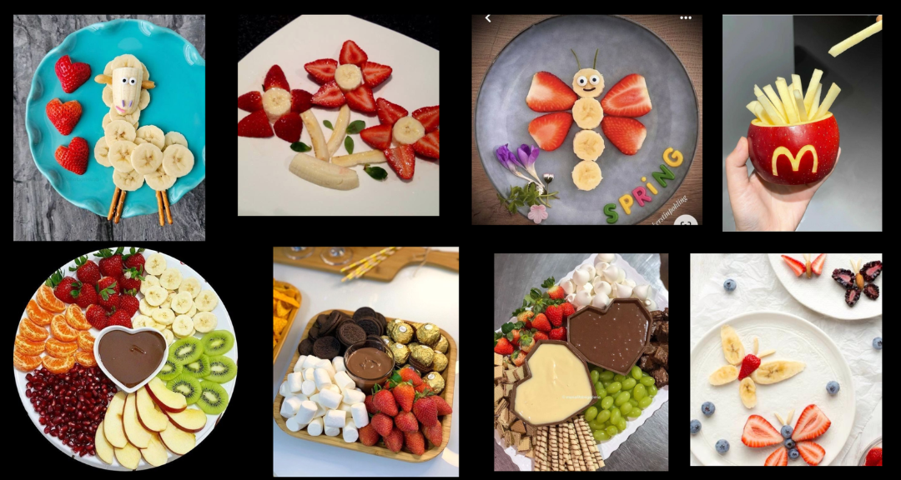
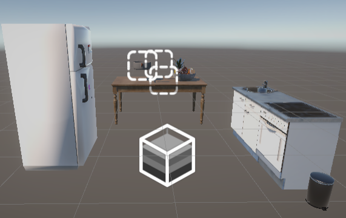

# Documentação do Projeto Remi - Realidade Virtual

## 1. Introdução e Contextualização

O projeto **Remi** tem como objetivo proporcionar uma experiência inovadora e educativa em realidade virtual, focada no aprendizado interativo para crianças. A ideia central é ensinar conceitos básicos de culinária de maneira envolvente, utilizando a realidade virtual para criar um ambiente imersivo onde os usuários possam explorar, interagir e aprender enquanto se divertem.

A experiência gira em torno da preparação de receitas criativas, como saladas de frutas em formatos divertidos, estimulando a criatividade e habilidades motoras das crianças. Além disso, o projeto aborda conceitos importantes de design de interação, usabilidade e narrativa, integrando elementos como diégese sonora e interatividade no cenário virtual. Atualmente, o projeto encontra-se na sua terceira semana de desenvolvimento, com avanços significativos na criação do cenário e integração de assets.

## 2. Progresso de Desenvolvimento da Semana 3

### 2.1 Ferramentas e Configuração Inicial

- Baixamos o **Unity** para iniciar a criação do:
    - cenário;
    - inserção de assets e;
    - integração de efeitos sonoros.
    
- **Assets** Desenvolvidos e Integrados:
    - **Faca**: Adicionamos uma faca como asset, que possui um efeito sonoro acionado ao ser tocada. Esse som faz referência às discussões sobre diégese apresentadas em sala de aula.
    
    <aside>
    
    💡 *Diégese*: conceito de narratologia, estudos literários, dramatúrgicos e de cinema que diz respeito à dimensão ficcional de uma narrativa
    
    </aside>
    

- **Cenário da Cozinha 3D**: criamos um cenário que inclui:
    - Pia;
    - Geladeira;
    - Fogão;
    - Faca;
    - Armários;
    - Panelas;
    - Tábua de cortar;
    - Fruteira.

## 3. Ideia Central do Projeto

O objetivo do projeto é criar uma experiência imersiva em realidade virtual para ensinar crianças a prepararem receitas de forma lúdica e interativa. O primeiro desafio será preparar **saladas de frutas criativas**, utilizando a interação com o ambiente virtual.

No caso, criamos um painel de referências, que será como um início de escolha para o usuário, que é o da imagem abaixo:

Assets que já estão disponíveis até o momento:

- Frutas;
- Fruteira;
- Geladeira;
- Pia;
- Faca (com efeito sonoro integrado).

## 4. Cenário no Unity

Colocar imagens do cenário + explicação e imagem dos assets

## 5. Experiência do Usuário

Para a experiência do usuário, vamos incrementar melhorias para a usabilidade e temos os seguintes tópicos abaixo como melhorias futuras:

- **Integração de mais ações**:
    - Adicionar ações para interagir com as frutas, como cortar, mover e posicionar no prato.
    - Implementar feedback visual e sonoro ao realizar essas ações, garantindo maior imersão, por exemplo um pop-up de parabéns!
- **Evolução do cenário**:
    - Adicionar elementos interativos ao cenário, como ação de abrir geladeira ou armários para pegar ingredientes.
    - Personalizar o cenário para torná-lo mais atraente para o público infantil (cores vibrantes, decorações temáticas).
- **Design do livro de receitas**:
    - Criar um livro de receitas animado que permite folhear páginas.
    - Apresentar as etapas do preparo de forma clara e visual, com animações simples.
- **Implementação de tutoriais, ou seja a adição do vídeo do personagem Linguini apresentando toda a jornada do usuário na imersão**:
    - Tutorial introdutório para ensinar as crianças a utilizar o ambiente virtual.
- **Menu principal**
    - Facilitando a retirada de dúvidas e também da navegação.
- **Melhorias na interação em geral**:
    - Garantir que os controles de interação sejam intuitivos, com foco em crianças de diferentes idades.
    - Ajustar a sensibilidade dos controles para manipular os objetos com precisão.
    - Inserir sons que simulam o ambiente de cozinha, como barulho de água na pia, panela no fogão e talheres.
- **Testes de Usabilidade**:
    - Testes com crianças para identificar dificuldades na navegação e interação.
    - Aprimorar o design e a funcionalidade de acordo com as opiniões recebidas.

## 6. Evolução das Fases

1. **Novos Modos de Jogo**:
    - Adicionar desafios com tempo limitado ou competições criativas.
2. **Gamificação**:
    - Implementar sistema de pontuação para recompensar a criatividade e precisão no preparo.

## 7. Assets
Os assets foram selecionados para representar os elementos do cenário de uma cozinha, como frutas, faca, geladeira e pia. A ideia é criar um ambiente interativo e imersivo. Num primeiro momento, utilizamos modelos prontos do [sketchfab](https://sketchfab.com/feed) para os modelos 3D, mas a ideia é personalizar os assets para torná-los mais atrativos e condizentes com a proposta do projeto.

- [Faca](https://sketchfab.com/3d-models/kitchen-knife-1d91ba79869d4370948f71c10cc17ab7)
- [Geladeira](https://sketchfab.com/3d-models/house-props-fridge-2fdaa56bbd85404cb4206dcaedc16658)
- [Pia, Bancada e Fogão](https://sketchfab.com/3d-models/small-kitchen-with-oven-e783d6d64f8c453ab534bdde715b210d)
- [Panela](https://sketchfab.com/3d-models/pan-8b6ae8478d514e0ea87dd61051244004)
- [Fruteira](https://sketchfab.com/3d-models/fruit-bowl-44056f29ea0f444db634233083e5af93)
- [Lixo](https://sketchfab.com/3d-models/trash-can-with-animations-garbage-can-animated-d4bed4900def46e7b2f098b0a9ec6209)
- [Mesa](https://sketchfab.com/3d-models/free-old-table-46f69d55576041d1bca6f1929b40bb3d)

Para os assets de som, utilzamos o [freesound.org](https://freesound.org/) para encontrar efeitos sonoros realistas, como o som de uma faca cortando frutas. A intenção é adicionar elementos sonoros que contribuam para a ambientação e imersão do usuário na experiência.

Um dos assets principais para testes foi o som de diegese da faca, que pode ser encontrado [aqui](https://freesound.org/people/neilsher/sounds/411741/).

Outros assets de som também foram retirados desse site e podem ser encontrados na pasta `assets/sounds`.